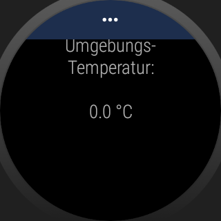
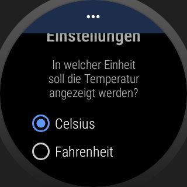
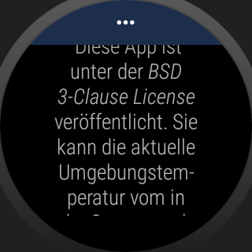

# WearOS-App: "Temperatur-Sensor" #

Android-Studio-Project for a WearOS-App which shows current ambient temperature as measured by a built-in sensor.
 
 

Identifiers (names for classes, variables and methods), UI texts and (JavaDoc) comments are in German only.

 

----

# Screenshots #

  

 

 

Screenshots were taken from emulator; on each the [Navigation Drawer](https://designguidelines.withgoogle.com/wearos/components/navigation-drawer.html) (area with three dots on upper edge of the display) is opened a bit.

 

----

# License #

See the [LICENSE file](LICENSE.md) for license rights and limitations (BSD 3-Clause License).
